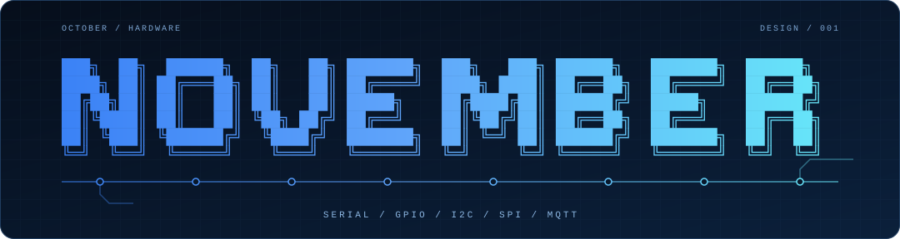

<div align="center">



<h1>November</h1>

<p><strong>An agentic harness for hardware</strong></p>

</div>

---

> Early design. Nothing to install yet.

November is being built to give agents tools for reading sensors, controlling pins, and talking to boards. Use the harness while building a device, then run it on that device.

Both use the same code, with stricter permissions on shipped devices.

## Hardware

November will run on Linux computers such as Raspberry Pi and Jetson. Smaller boards, including Arduino, ESP32, and STM32, will connect to a host running November.

Planned tools: serial, GPIO, I2C/SPI, MQTT, and simulated devices for testing.

## How it fits together

```text
  Development terminal       Device service
           |                       |
           +-----------+-----------+
                       |
                  November core
                       |
               Permission checks
                       |
          Serial / GPIO / I2C / SPI / MQTT
```

Reuse an existing agent loop, starting with Pi's core as a candidate. Build the device tools, permissions, action logs, and recovery here.

The terminal and device service use that same core. Shipped devices don't need the coding UI or development permissions.

## Rules for hardware

If a pump runs but its reply gets lost, retrying could run it twice. November must track what happened, including when it doesn't know.

- Check actions outside the model. Allow only named devices and operations. No bypass through a shell, device files, or MQTT credentials.
- Limit values, duration, frequency, and allowed device states.
- Save command IDs and outcomes across restarts. Check uncertain results before retrying; don't repeat completed actions.
- Keep emergency stops and watchdogs in hardware or firmware, independent of the harness.
- Define what each device does when the network or model is unavailable. Local models are optional; fallback behavior isn't.
- Log readings, decisions, and results. Limit storage and keep secrets out.
- Version settings and permissions. Test updates and rollback. Agents using the harness cannot change their own permissions.

Not ready for unattended or safety-critical use. Each device will need its own safety review and testing.

## First test

One Linux board, a USB-connected microcontroller, a sensor, an LED, and MQTT.

Test it in simulation, use it from a terminal, then run it as a background service. Disconnect the network, repeat a command, drop a reply, and restart the process.

It must stay within its limits, avoid duplicate actions, and show what happened. More boards and fleet tools come later.

## October

[October Harness](https://github.com/october-dev/october-harness) can provide the coding interface. [October Bus](https://github.com/october-dev/october-bus) can connect agents. Neither is required, and Bus messages cannot grant device permissions.

It should work without an October account and let you choose your model provider.

## Contributing

Have a device in mind? Open an issue with the board, connection, what it should do, and what must happen when it fails.

Read [CONTRIBUTING.md](CONTRIBUTING.md) for contribution, reproduction, and public-data requirements. Report vulnerabilities privately using [SECURITY.md](SECURITY.md), which also describes version support and updates.

## License

Copyright 2026 November contributors.

November is licensed under the [Apache License, Version 2.0](LICENSE). Third-party material retains its own licenses and required notices; see [reuse and attribution](CONTRIBUTING.md#reuse-and-attribution).
